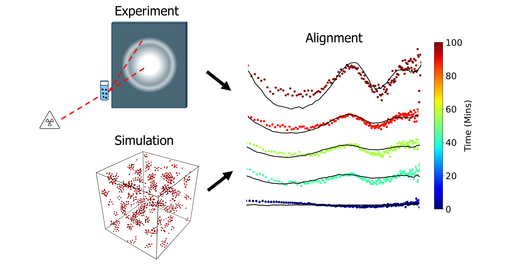

# series_alignment
[](https://deepwiki.com/huatc/series_alignment)

A series alignment algorithm to match molecular simulations with experimental characterization. 

<p align="center">
  
</p>


## Installation (for conda)
To install the package, first git clone the repository. Then create the conda
environment (named `series_alignment`) from the provided `environment.yml`:

```
conda env create -f environment.yml
conda activate series_alignment
```

### Environment

The environment is built on **Python 3.12** and includes:

| Package | Version | Used for |
| --- | --- | --- |
| numpy | 2.4 | array / numerical operations |
| scipy | 1.17.1 | cubic-spline interpolation, integration |
| pandas | 3.0 | loading experimental data (Excel/CSV) |
| scikit-learn | 1.9.0 | MinMax scaling of distributions |
| matplotlib | 3.10.9 | plotting cost matrices and alignments |
| openpyxl | 3.1.5 | reading `.xlsx` kinetics data |
| apdist | 1.0.0 | amplitude–phase (elastic) shape distance |
| funcshape, warping | 1.0 | `apdist` dependencies (function registration) |
| torch | 2.12.0 (CPU) | GPU/torch backend for amplitude–phase distance |
| torchcubicspline | 0.0.3 | differentiable cubic splines for the torch backend |

## Usage

Follow the examples and instructions in the Notebooks folder to use the series
alignment algorithm. Standalone script versions of the DLS and SAXS pipelines
live in the `Scripts` folder (`dls_apdist.py`, `saxs_apdist.py`). 